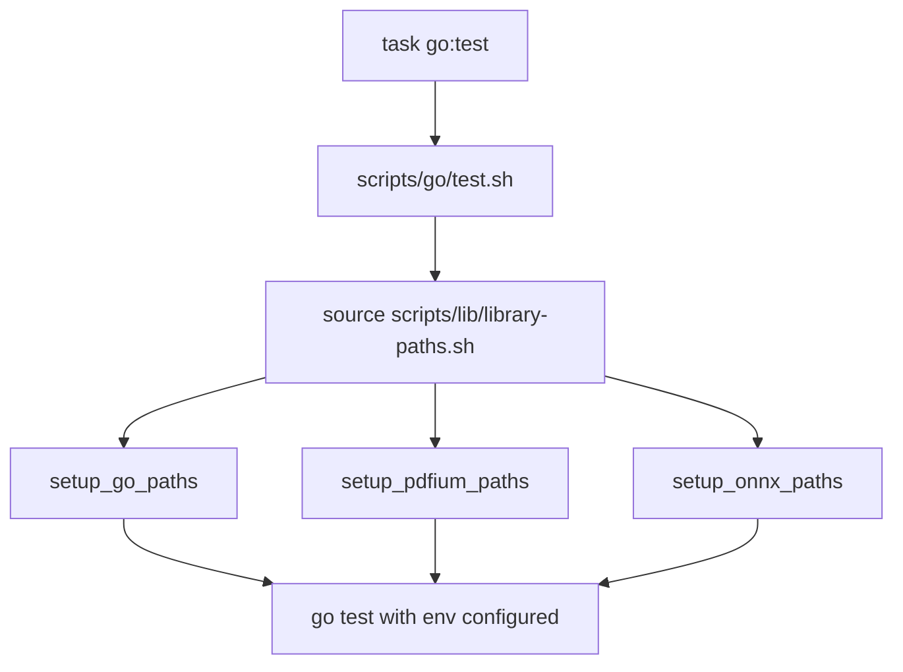

# Test Execution Patterns

**Proper test execution using Taskfile with required environment setup**

## Critical Rules for Running Tests

### Rule 1: ALWAYS use Taskfile for Tests
**NEVER run tests directly** - CI failures should NOT be debugged by re-running tests locally in ad-hoc ways.

```bash
# ❌ WRONG - Direct test execution
go test ./...
pytest tests/
npm test

# ✅ CORRECT - Use Task
task go:test
task python:test
task typescript:test
```

**Why?** The Taskfile ensures:
- Correct environment variables are set
- Required dependencies are downloaded (PDFium, ONNX Runtime)
- Library paths are configured properly (LD_LIBRARY_PATH, DYLD_LIBRARY_PATH, PATH)
- FFI bindings are built and accessible
- Platform-specific quirks are handled

### Rule 2: Environment Setup is Automated

The test scripts automatically configure:

**For Go (`scripts/go/test.sh`)**:
```bash
# Automatically sources:
source "${REPO_ROOT}/scripts/lib/common.sh"
source "${REPO_ROOT}/scripts/lib/library-paths.sh"

# Then calls:
setup_go_paths "$REPO_ROOT"  # Sets CGO flags, PKG_CONFIG_PATH
setup_pdfium_paths           # Configures PDFium library location
setup_onnx_paths             # Configures ONNX Runtime if ORT_LIB_LOCATION set
```

**For Python (`scripts/python/test.sh`)**:
```bash
# Sets up virtual environment with uv
# Configures ONNX Runtime paths
# Downloads PDFium runtime
```

**For TypeScript (`scripts/typescript/test.sh`)**:
```bash
# Sets up pnpm dependencies
# Configures native module paths
# Handles NAPI-RS bindings
```

## ONNX Runtime Configuration

### macOS (Homebrew)
ONNX Runtime must be installed and configured:

```bash
# Install if not present
brew install onnxruntime

# Set environment variable for tests
export ORT_LIB_LOCATION=/opt/homebrew/opt/onnxruntime/lib

# Now run tests
task go:test
```

**Location**: Brew installs to `/opt/homebrew/opt/onnxruntime/lib` (Apple Silicon) or `/usr/local/opt/onnxruntime/lib` (Intel)

### Linux
```bash
# Download and extract ONNX Runtime
export ORT_LIB_LOCATION=/path/to/onnxruntime/lib
export LD_LIBRARY_PATH="$ORT_LIB_LOCATION:$LD_LIBRARY_PATH"

task go:test
```

### Windows
```bash
# Download ONNX Runtime binaries
$env:ORT_LIB_LOCATION="C:\path\to\onnxruntime\lib"
$env:PATH="$env:ORT_LIB_LOCATION;$env:PATH"

task go:test
```

### CI Configuration
In GitHub Actions, ONNX Runtime is set up via:
```yaml
- name: Setup ONNX Runtime
  uses: ./.github/actions/setup-onnx-runtime
  with:
    ort-version: ${{ env.ORT_VERSION }}
```

This action:
1. Downloads the correct ONNX Runtime version for the platform
2. Sets `ORT_LIB_LOCATION` environment variable
3. Adds to library search paths (LD_LIBRARY_PATH, DYLD_LIBRARY_PATH, PATH)
4. Sets `ORT_DYLIB_PATH` for direct binary reference

## Library Path Setup

### How setup_go_paths Works

**Location**: `scripts/lib/library-paths.sh`

```bash
setup_go_paths() {
  local repo_root="${1:-${REPO_ROOT:-}}"

  # Generate pkg-config file if missing
  export PKG_CONFIG_PATH="${repo_root}/crates/kreuzberg-ffi:${PKG_CONFIG_PATH:-}"

  # Enable CGO
  export CGO_ENABLED=1
  export CGO_CFLAGS="-I${repo_root}/crates/kreuzberg-ffi/include"

  # Platform-specific library paths
  case "$platform" in
  Linux)
    export LD_LIBRARY_PATH="${repo_root}/target/release:${LD_LIBRARY_PATH:-}"
    export CGO_LDFLAGS="-L${repo_root}/target/release -lkreuzberg_ffi -Wl,-rpath,${repo_root}/target/release"
    ;;
  macOS | Darwin)
    export DYLD_LIBRARY_PATH="${repo_root}/target/release:${DYLD_LIBRARY_PATH:-}"
    export DYLD_FALLBACK_LIBRARY_PATH="${repo_root}/target/release:${DYLD_FALLBACK_LIBRARY_PATH:-}"
    export CGO_LDFLAGS="-L${repo_root}/target/release -lkreuzberg_ffi -Wl,-rpath,${repo_root}/target/release"
    ;;
  Windows)
    export CGO_LDFLAGS="-L${repo_root}/target/x86_64-pc-windows-gnu/release -L${repo_root}/target/release"
    ;;
  esac
}
```

### How setup_onnx_paths Works

```bash
setup_onnx_paths() {
  local ort_lib="${ORT_LIB_LOCATION:-}"
  [ -z "$ort_lib" ] && return 0  # Skip if not set

  case "$platform" in
  Linux)
    export LD_LIBRARY_PATH="${ort_lib}:${LD_LIBRARY_PATH:-}"
    ;;
  macOS | Darwin)
    export DYLD_LIBRARY_PATH="${ort_lib}:${DYLD_LIBRARY_PATH:-}"
    export DYLD_FALLBACK_LIBRARY_PATH="${ort_lib}:${DYLD_FALLBACK_LIBRARY_PATH:-}"
    ;;
  Windows)
    export PATH="${ort_lib};${PATH:-}"
    ;;
  esac
}
```

**Key Insight**: If `ORT_LIB_LOCATION` is not set, ONNX Runtime tests will fail with:
```
libonnxruntime.dylib: cannot open shared object file
```

## Test Execution Workflow

### Standard Test Flow


### Required Build Order
```bash
# 1. Build Rust FFI library
cargo build --release --package kreuzberg-ffi

# 2. Download PDFium runtime (automatic in test scripts)
scripts/download_pdfium_runtime.sh

# 3. Set up ONNX Runtime (if needed for embedding tests)
export ORT_LIB_LOCATION=$(brew --prefix onnxruntime)/lib

# 4. Run tests via Task
task go:test
```

## Language-Specific Patterns

### Go Tests
```bash
# Standard test run
task go:test

# Verbose output
task go:test:verbose

# CI mode (with enhanced debugging)
task go:test:ci

# Debug mode (with custom options)
task go:test:debug

# E2E tests only
task go:e2e:test
```

**Files**:
- Task definition: `.task/languages/go.yml`
- Test script: `scripts/go/test.sh`
- Library paths: `scripts/lib/library-paths.sh`

### Python Tests
```bash
# Standard test run
task python:test

# CI mode (with coverage)
task python:test:ci

# Verbose output
task python:test:verbose
```

**Files**:
- Task definition: `.task/languages/python.yml`
- Test script: `scripts/python/test.sh`

### TypeScript Tests
```bash
# Standard test run
task typescript:test

# CI mode
task typescript:test:ci

# Watch mode
task typescript:test:watch
```

**Files**:
- Task definition: `.task/languages/typescript.yml`
- Test script: `scripts/typescript/test.sh`

### Java Tests
```bash
task java:test
task java:test:ci
```

### Ruby Tests
```bash
task ruby:test
task ruby:test:ci
```

### C# Tests
```bash
task csharp:test
task csharp:test:ci
```

### PHP Tests
```bash
task php:test
task php:test:ci
```

### Elixir Tests
```bash
task elixir:test
task elixir:test:ci
```

## Debugging Test Failures

### Pattern 1: Check Environment Setup
```bash
# Set verbose mode to see environment details
export CI=true
export VERBOSE_MODE=true
task go:test
```

This shows:
- Go version
- Working directory
- LD_LIBRARY_PATH / DYLD_LIBRARY_PATH
- CGO_ENABLED
- CGO_CFLAGS
- CGO_LDFLAGS

### Pattern 2: Verify FFI Library Exists
```bash
# Check if FFI library is built
ls -lh target/release/libkreuzberg_ffi.*

# macOS
ls target/release/libkreuzberg_ffi.dylib

# Linux
ls target/release/libkreuzberg_ffi.so

# Windows
ls target/release/kreuzberg_ffi.dll
```

### Pattern 3: Verify ONNX Runtime Setup
```bash
# macOS
echo $ORT_LIB_LOCATION
ls -lh $ORT_LIB_LOCATION/libonnxruntime*.dylib

# Linux
echo $ORT_LIB_LOCATION
ls -lh $ORT_LIB_LOCATION/libonnxruntime*.so

# Windows
echo $env:ORT_LIB_LOCATION
ls $env:ORT_LIB_LOCATION\onnxruntime.dll
```

### Pattern 4: Check PDFium Download
```bash
# PDFium is auto-downloaded by test scripts
# Verify it exists:
ls -lh target/release/libpdfium.dylib    # macOS
ls -lh target/release/libpdfium.so       # Linux
ls target/release/pdfium.dll             # Windows
```

## Common Test Failure Patterns

### Failure: "Package 'kreuzberg-ffi' not found"
**Cause**: PKG_CONFIG_PATH not set or kreuzberg-ffi.pc missing

**Fix**:
```bash
# Let the test script generate it
task go:test

# Or manually
export PKG_CONFIG_PATH="$PWD/crates/kreuzberg-ffi:$PKG_CONFIG_PATH"
```

### Failure: "libonnxruntime.dylib: cannot open shared object file"
**Cause**: ORT_LIB_LOCATION not set

**Fix**:
```bash
# macOS
export ORT_LIB_LOCATION=/opt/homebrew/opt/onnxruntime/lib

# Linux (download from GitHub releases)
export ORT_LIB_LOCATION=/path/to/onnxruntime-linux-x64-1.23.2/lib

# Run tests
task go:test
```

### Failure: "undefined reference to `kreuzberg_extract_file_sync`"
**Cause**: FFI library not built or not in library path

**Fix**:
```bash
# Build FFI library
cargo build --release --package kreuzberg-ffi

# Verify library path
export DYLD_LIBRARY_PATH="$PWD/target/release:$DYLD_LIBRARY_PATH"

# Run tests
task go:test
```

### Failure: Segmentation fault
**Cause**: Multiple possible causes - version mismatch, memory corruption, threading issue

**Debug**:
```bash
# Enable full backtrace
export RUST_BACKTRACE=full
export RUST_LIB_BACKTRACE=1

# Run single test
cd packages/go/v4
go test -run TestNameHere -v

# Check for race conditions
go test -race -run TestNameHere
```

## CI vs Local Differences

### CI Environment
- Runs on clean containers (no cached dependencies)
- Uses pre-built artifacts from build job
- Downloads PDFium and ONNX Runtime automatically
- Sets all environment variables via GitHub Actions

### Local Environment
- May have stale build artifacts
- Requires manual ONNX Runtime installation (Homebrew)
- FFI library must be built locally
- Environment variables may persist from previous runs

**Best Practice**: Test locally with `task` BEFORE pushing to CI to catch issues early.

## Test Isolation

### Go Test Mutex Pattern
**Location**: `packages/go/v4/ffi.go`

```go
// Serialize FFI calls to prevent concurrent PDFium access
var ffiMutex sync.Mutex

func ExtractFileSync(path string, config *ExtractionConfig) (*ExtractionResult, error) {
    ffiMutex.Lock()
    defer ffiMutex.Unlock()
    // ... FFI call
}
```

**Why?** PDFium is not thread-safe. The mutex prevents concurrent access and potential segfaults.

### Python Test Isolation
Tests use `@pytest.mark.asyncio` and `pytest-asyncio` for proper async isolation.

### TypeScript Test Isolation
Uses Jest's worker threads for parallel test execution with FFI bindings.

## Performance Considerations

### Test Timeouts
- Go: 10 minutes (`-timeout 10m` in `scripts/go/test.sh`)
- Python: 120 seconds per test (configurable in `pytest.ini`)
- TypeScript: 30 seconds per test (Jest default)

### Parallel Execution
- Go: Default parallel execution (can override with `-p 1`)
- Python: `pytest-xdist` for parallel tests (`pytest -n auto`)
- TypeScript: Jest workers (default CPU count)

## Related Skills

- **extraction-pipeline-patterns** - Understanding what tests validate
- **ocr-backend-management** - ONNX Runtime and Tesseract setup for OCR tests
- **feature-flag-strategy** - Conditional test execution based on available backends
- **mcp-protocol-integration** - Testing MCP server implementations

## Summary Checklist

Before running tests:
- [ ] Built FFI library (`cargo build --release --package kreuzberg-ffi`)
- [ ] Set `ORT_LIB_LOCATION` if testing embeddings
- [ ] Using `task <language>:test` (NOT direct test commands)
- [ ] Verified environment setup (run with `VERBOSE_MODE=true` if unsure)

When tests fail in CI:
- [ ] Reproduce locally with `task <language>:test`
- [ ] Check environment variables match CI setup
- [ ] Verify dependencies are installed (ONNX Runtime, PDFium)
- [ ] Review test script logs for environment details
- [ ] Run single failing test in isolation for debugging
